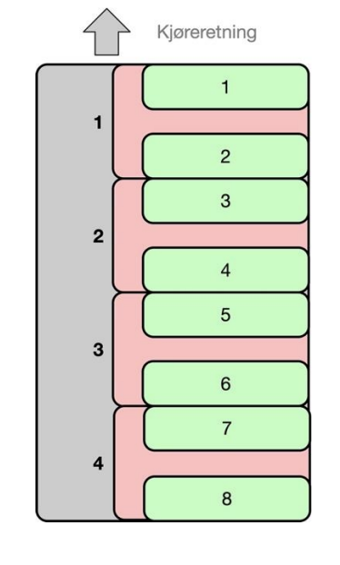

# Oppgavebeskriveøse

Det skal lages en database for jernbanen i Norge. For å få hensiktsmessig kompleksitet og
arbeidsmengde, må vi selvfølgelig forenkle beskrivelsen av jernbanesystemet en god del. I arbeidet
med prosjektet vil det bli behov for å gjøre en del forutsetninger. De forutsetningene dere gjør må
dokumenteres i prosjektrapporten.

Jernbanenettet i Norge består av en del fysiske banestrekninger, for eksempel Nordlandsbanen som
går fra Trondheim til Bodø, og Dovrebanen som går fra Oslo til Trondheim. En banestrekning starter
på en jernbanestasjon, går innom et antall jernbanestasjoner og slutter på en jernbanestasjon. Alle
banestrekninger har et navn, er tilrettelagt for en fremdriftsenergi som er elektrisk eller diesel, og
består av et antall delstrekninger. En delstrekning går mellom to jernbanestasjoner, har en lengde i km
og er enten enkeltspor eller dobbeltspor. Jernbanestasjoner har et unikt navn, og det er registrert hvor
høyt stasjonen ligger (antall moh – meter over havet). 

I figuren har vi vist en forenklet utgave av Nordlandsbanen, denne skal vi også bruke når vi lagrer data
i databasen. Her har vi foregrepet dobbeltspor mellom Trondheim og Steinkjer siden dette er svært
nødvendig og burde vært på plass for lenge siden. På
Nordlandsbanen drives togene med diesel.

På en banestrekning kjøres det togruter som kan kjøre i
banestrekningens hovedretning eller mot denne. For
Nordlandsbanen er hovedretningen fra Trondheim til Bodø. En
togrute kan kjøre hele banestrekningen, men en togrute kan også gå
over bare en del av banestrekningen, for eksempel fra Mo i Rana til
Trondheim. En togrute har en startstasjon og en endestasjon, og går
vanligvis innom noen stasjoner mellom disse. For hver
jernbanestasjon på togruten, har vi ankomsttid/avgangstid, unntatt
startstasjonen der togruten bare har avgangstid, og endestasjonen
der togruten bare har ankomsttid. En togrute kjøres høyst en gang
per dag, og det må registreres hvilke ukedager togruten kjører fra
startstasjonen.

En togrute kjøres av en operatør, på Nordlandsbanen er dette SJ,
som har et antall vogntyper der kunder kan kjøpe billett til plasser.
En vogntype har et navn og er enten en sittevogn eller en sovevogn.
Sittevogner har et antall stolrader der det er et antall seter på hver
rad. Setene er nummerert fra forenden av vogna og fra venstre mot
høyre. I en vogn med fire seter på hver rad, vi sitteplassene en til fire
på første rad, på andre rad har vi plassene fra fem til åtte osv. En
sovevogn består av et antall sovekupéer som nummereres fra
forenden av vogna og bakover, slik at en sovevogn med fire
sovekupéer vil ha kupénummer fra en til fire. Sengene nummereres fra forenden av vogna og slik at
den nedre senga har lavest nummer i en kupé. En sovevogn med fire sovekupéer vil ha soveplasser fra
nummer en til nummer åtte, der soveplass nummer seks er den øvre senga i kupé nummer tre.

En togrute har et fast vognoppsett, satt sammen av togvogner av tilgjengelige vogntyper, for eksempel
to sittevogner og en sovevogn. I et vognoppsett nummereres vognene forfra og bakover i toget, slik at
vogna som er rett etter lokomotivet, er vogn nummer en. I oppgaven ser vi bort fra lokomotiv og andre
servicevogner som kan inngå i et vognoppsett. En togrute har en fast togrutetabell med avgang-
/ankomst-tider for hver stasjon på ruten.

En togrute har en togruteforekomst for hver dag som togruten kjøres. For å reise med en togrute
kjøper en kunde billett til en eller flere plasser i en togruteforekomst. For å kjøpe billetter må man være registrert som kunde i operatørenes felles kunderegister, med unikt kundenummer, navn, epostadresse og mobilnummer. Et billettkjøp er organisert i en kundeordre som har et unikt
ordrenummer, dag og tid for kjøpet og et antall billettkjøp i en og samme togruteforekomst. For å
forenkle oppgaven, ser vi bort fra priser og betaling av billetter. En billett gjelder enten et sete i en
sittevogn eller en seng i en sovevogn, og reserverer plassen fra en stasjon på ruten til en annen stasjon
på ruten. Det skal ikke være mulig å kjøpe billetter til plasser som allerede er solgt. Men en og samme
sitteplass kan selges til flere kunder så lenge reisene ikke overlapper. En kunde kan kjøpe en eller to
plasser i en sovekupé. Dersom en kunde har reservert en seng i en sovekupé, kan vi ikke selge den
ledige senga til en annen kunde. Hvis noen har billett til en av sengene i en sovekupé på en del av
strekningen, selger vi ikke plassene i kupéen til andre, selv om deres reise ikke overlapper med reisen
til den som allerede har kjøpt soveplass.

## Brukerhistorier
a) Databasen skal kunne registrere data om alle jernbanestrekninger i Norge. Dere skal legge inn
data for Nordlandsbanen (som vist i figuren). Dette kan gjøres med et skript, dere trenger ikke å
programmere støtte for denne funksjonaliteten.

b) Dere skal kunne registrere data om togruter. Dere skal legge inn data for de tre togrutene på
Nordlandsbanen som er beskrevet i vedlegget til denne oppgave. Dette kan gjøres med et skript,
dere trenger ikke å programmere støtte for denne funksjonaliteten.

c) For en stasjon som oppgis, skal bruker få ut alle togruter som er innom stasjonen en gitt ukedag.
Denne funksjonaliteten skal programmeres.

d) Bruker skal kunne søke etter togruter som går mellom en startstasjon og en sluttstasjon, med
utgangspunkt i en dato og et klokkeslett. Alle ruter den samme dagen og den neste skal
returneres, sortert på tid. Denne funksjonaliteten skal programmeres.

e) En bruker skal kunne registrere seg i kunderegisteret. Denne funksjonaliteten skal programmeres.

f) Det skal legges inn nødvendige data slik at systemet kan håndtere billettkjøp for de tre togrutene
på Nordlandsbanen, mandag 3. april og tirsdag 4. april i år. Dette kan gjøres med et skript, dere
trenger ikke å programmere støtte for denne funksjonaliteten.

g) Registrerte kunder skal kunne finne ledige billetter for en oppgitt strekning på en ønsket togrute
og kjøpe de billettene hen ønsker. Denne funksjonaliteten skal programmeres.
- Pass på at dere bare selger ledige plasser

h) For en bruker skal man kunne finne all informasjon om de kjøpene hen har gjort for fremtidige
reiser. Denne funksjonaliteten skal programmeres.

## Vedlegg

### Rutetabell for dagtog fra Tronheim til Bodø

Denne togruten kjøres alle hverdager og har et vognoppsett med to sittevogner av typen SJ-sittevogn1.

### Rutetabell for nattog fra Trondheim til Bodø 

Denne togruten kjøres alle dager og har et vognoppsett med en sittevogn av typen SJ-sittevogn-1 fulgt
en sovevogn av typen SJ-sovevogn-1.

### Rutetog for morgentog fra Mo i Rana til Trondheim

Denne togruten kjører alle hverdager og har et vognoppsett med en sittevogn av typen SJ-sittevogn1.

## Vogntyper
### Sittevogn (type: SJ-sittevogn-1) 

Vogntypen har tre rader med fire seter, til sammen 12 sitteplasser som er nummerert fra 1 til 12.

### Sovevogn (type: SJ-sovevogn-1) 
Vogntypen har fire sovekupéer med to senger i hver, til sammen 8 soveplasser.

